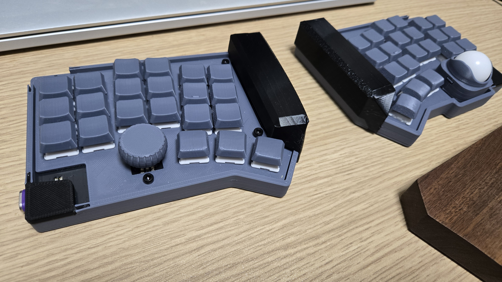
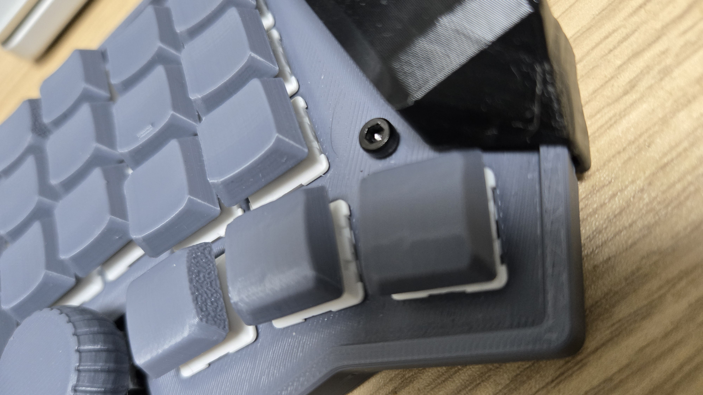
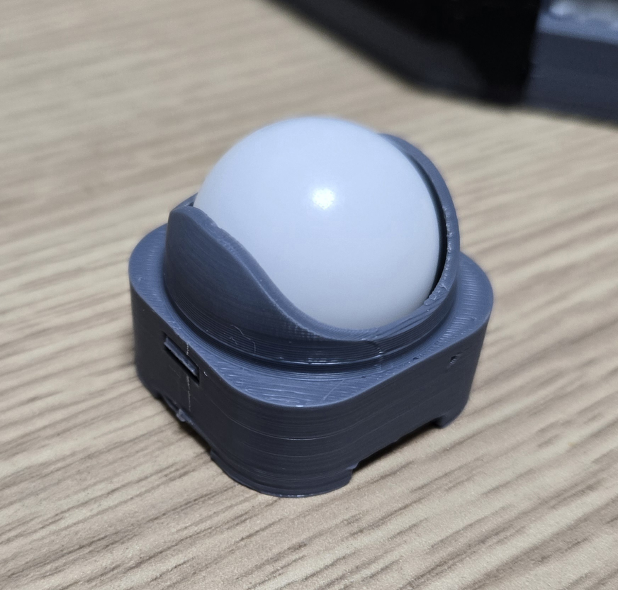
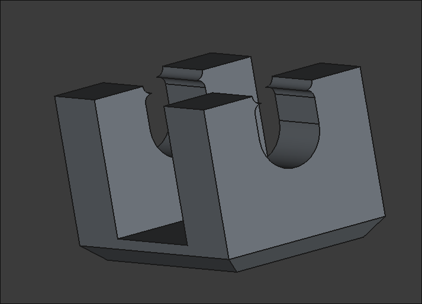

#+startup: content logdone inlneimages

#+hugo_base_dir: ../
#+hugo_section: posts/2025/11
#+author: derui

* ✨ トラックボールを搭載したキーボードを作った話 :自作キーボード:
CLOSED: [2025-11-24 月 21:11]
:PROPERTIES:
:EXPORT_FILE_NAME: keyboard-with-trackball
:END:
気が付いたら11月も終わって師走になりそうですね？一年が年々早くなっていきますな。

この二ヶ月くらい格闘していたものができました。なんかこないだもこの書き出しをした気がしますが気にしてはいけない。

** まずは写真
最近は一体型にしてましたが、roBaとかroRaとか人気ですんで、分割型に戻ってきました。やっぱ楽ですね。

スペックはこんなんです。

- いつもの40%/42キー
  - 30%はあんまり興味ないので
- 16.6mmピッチ
- Choc v2専用
- PMW3610センサーを利用したトラックボール
- 完全無線
- 単三電池駆動
- エンコーダー対応
- ケース、キーキャップ、エンコーダー、トラボケース、スイッチプレートまで全部3Dプリンター製
  - 今回発注したのは基盤類だけです
- それなりの薄さ
  - キートップまで2.2cmです

名前は、それなりに薄さを追求してみよう、ということで *ThingnusBall* です。いつもどおりケースやらなんやらは以下のリポジトリで公開してます。

https://github.com/derui/ThingnusBall

** 今回の物理配列
今回ですが、前作った Orbit One を分割型に持っていったような感じにしてます。やっぱ自分の手をそれなりに測って作っただけあって、しっくりきていたのは強いですね。

挟ピッチにしているのは、もはや一回慣れてしまうと、MacBook（仕事用）ですら広く感じてしまいます。キーキャップも自炊（なにか違う気がする）できるようになったということもあり、自由度が上がっています。

** キーキャップ
前回は初めて印刷しましたが、今回もうちょっと頑張ってコンベックスとスフェリカルのキーを印刷しました。こんな感じ。

物理になると分かりづらいんですが、コンベックスはちゃんとコンベックスしてます。なお、前回印刷したスフェリカルは指を置く面がちと狭かったので、全面に広げています。なお、色々めんどうなので、 *印刷時にはサポートがいらないように* 印刷してます。側面を立てる感じにして印刷しているので、どうしてもこういう形だと、底面になる面の角がヌルくなりますね。
とはいえ、これが嫌だとすると、 *光造形* か *焼結方式* 、または射出形成が必要になってくるんではないかと。FDMで軸を下にしてサポートを追加するのはだいぶリスキーです。

#+begin_quote
DMM.makeで販売されているキーキャップは、大半が焼結方式・・・のはずです。私もちょっとだけ持ってますが、手触りとかいいですよね。高いんですが。
#+end_quote

もしかしたらMXキーであれば余裕が出るのかもしれないですが :thinking: 今回は厚さをメインテーマにしたので、そもそもMXは選択肢に入っていませんでしたね。とはいえ、実際に指を置く面はかなり滑らかで、手元にあるNuphyのキーと比較してもひけをとりません（当社比）。

** 厚さ
前回がトータル4cmくらいの大作になってしまって、尊師スタイルをやろうとしたら *分厚すぎてほぼできなかった :cry:* という悲しい現実がありました。

#+begin_quote
https://salicylic-acid3.hatenablog.com/entry/sonshi-introduction

尊師スタイルはこちらなどを参考に。尊師＝RMSです。色々批判もある方ですが。
#+end_quote

前々回も結構分厚かったので、今回は *トラックボールのブレイクアウトボード含めて（できるだけ）薄くしよう！* というのを唯一のデザイン目標にしました。

*** 最小の厚さとは？
さて、一般的なキーボード（ロープロ）で実現できる最小の厚みとはどれくらいなのでしょう？一旦以下の条件を前提にして計算してみましょう。

- ホットスワップする
- スイッチプレートを使う
- choc v2

| 構成物           | 厚さ(mm) |
|------------------+----------|
| ソケット         |        2 |
| 基盤             |      1.6 |
| スイッチプレート |      1.5 |
| choc v2          |      6.4 |
| キーキャップ     |        3 |
|------------------+----------|
| 合計             |     14.5 |

(choc v2は軸の頂点まで、キーキャップはキーの軸の頂点から天面まで、です)

ということで、 =14.5mm= が実用に供する厚み・・・ということにします。意外と厚いと思うか薄いと思うかは個人の感覚なのであれですが。今回はブレイクアウトボードとして [[https://bulblub.booth.pm/items/6363907][SEIBOKU]] を利用させてもらっています。で、SEIBOKU + PWM3610 + レンズの厚みが =5.6mm= くらいあります。

PMW3610の読み取り面は、SEIBOKUの基盤から約 =4.4mm= のところにあります。シンプルに基盤と同じ高さにしようとすると、トラックボールがとにかく高くなりますね？これは困ります。

*** 今回の選択
今回は、薄さの方を優先して、多少の使い勝手は（気にするけど）オミットする、という方向にしました。

- XIAOは *基盤の裏に乗せる*
- SEIBOKUはあえて基盤の裏に乗せて、1.6mm分短縮
- ソケット分+XIAOとして3.6mmが裏のバッファ

です。ケースは底が3mmとして、だいたいchocのキー本体が隠れるサイズとして =13mm= にとどめました。これによって、だいたいキーの天面で2.2cm・・・というところになりました。正直厚みだけでいえば、基盤2枚とアクリル２枚で実装した最初のキーボードが最薄だったのですが。

** トラボのケース
こんな感じです。

「せっかく3Dプリンターあるからこれも設計してみるか」と思ったのが運のつき、めちゃくちゃ苦労しました・・・。この形状とベアリングの配置に行き着くまでで10回以上は試作したと思います。3Dプリンターあってよかったのか悪かったのか。ちなみに今使ってるGameBallと違ってベアリング搭載となっています。ベアリングはミネベアミツミのミニチュアベアリングを利用しています。

なお、4mmの半径に1.5mmのシャフトを指で通すのは無理ゲーです。もしやろうとされている方は、きちんとシャフトの刺し方を学んでからにしたほうがよろしいかと思います。私は朝無理やりやりました。

ベアリングは、当初表面に埋めようとしていたのですが、まったく精度が出ない & 固定できないという問題が頻発しました。仕方ないので、こんな部品を設計して印刷しました。ちなみにサイズは =6mm x 4mm= 程度です。0.4mmノズルだとめっちゃギリギリです。

これに対応するだいたいぴったりの穴をケースにあけて、

1. ベアリングを部品にスナップでいれる
2. 1.の部品をできるだけ真っ直ぐになるようにケース内部に埋める

という手順で構成しました。かなり苦労した甲斐あって、非常に安定している & 移動させても問題ない、というところになりました。

** マグネットの利用
なんか昔の記憶だと、電化製品に磁石は厳禁・・・って刷り込まれてたんですが、そもそも電場に影響を与えられる磁力、というのがそもそもそこら辺の磁石でどうにかなるレベルではない、ということもわかりました（そもワイヤレスイヤホンとか、普通に充電にポゴピン利用してるし）。

なので、今回は２箇所に仕込んでみました。一箇所はトラボケースで、これは着脱を容易にしてメンテナンスしやすくしよう、という意図です。もう一箇所は *ケースの裏* で、持ち運びをするときにサクッとまとめて持っていけるように・・・と思ってやってみました。そこまで持ち運ぶ頻度が高いわけでもないのですが。

** ケースの設計
前回はいきなり２ピースに手を出しましたが、今回はシンプルに倒しました。シンプルだと印刷も１時間くらいで時間がかからなくていいですね・・・（遠い目）。ただ、スライドスイッチの品番を間違えて、そもそものスイッチの場所が狂ったりと、うまくいかない場所が多いのもなかなか難しいですね。

** 今年のキーボード作成はこれで終わり
なんだかんだ、今年だけで４つも作ってしまいました。やるたび課題がみつかりはするものの、だんだんこなれてくると楽しくなってきますね。3D CADの設計が現状一番むずかしいところではありますが・・・。

やるたび学びがあるのは、非常にやってて楽しいというものです。が、最近あんまりプログラミングできていないので、たまにはそっちもやっていきたいところです。

* Comment Local Variables                                           :ARCHIVE:
# Local Variables:
# eval: (org-hugo-auto-export-mode)
# End:

